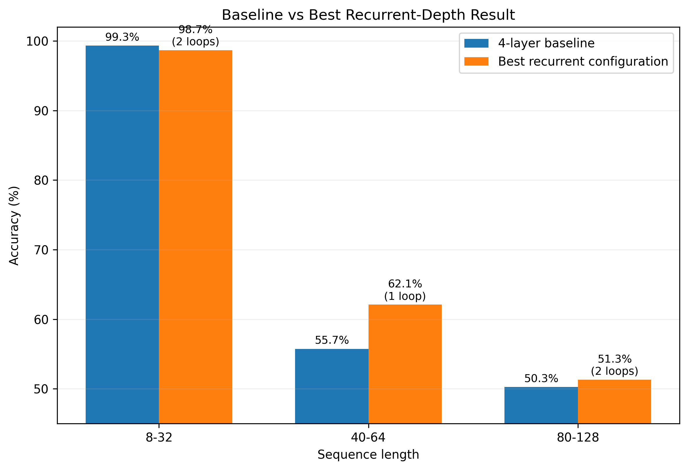
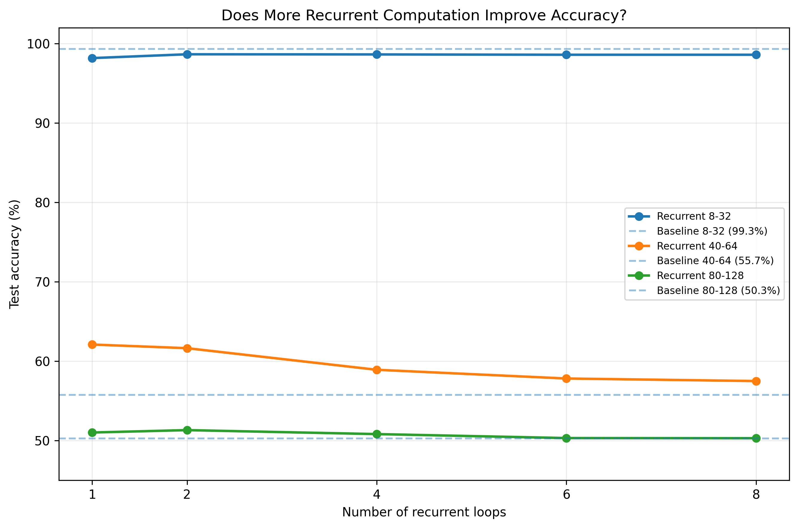
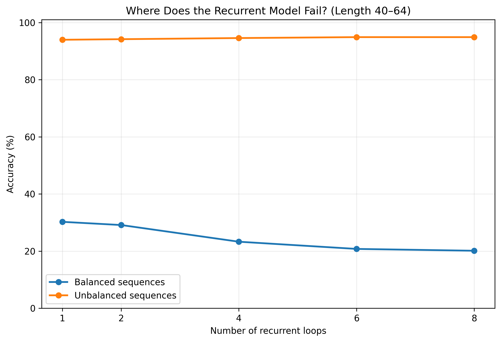

# Recurrent Depth Demo: Can a Small Transformer Think Longer?

A small-scale PyTorch experiment exploring whether a Transformer can gain useful reasoning capacity by **reusing the same layer multiple times**, rather than becoming deeper through additional unique layers.

This project is inspired by the recurrent-depth approach presented in:

> **Scaling up Test-Time Compute with Latent Reasoning: A Recurrent Depth Approach**  
> Jonas Geiping et al., NeurIPS 2025

This repository is an **educational experiment inspired by the paper**, not a reproduction of the original work.

---

## Motivation

Modern neural networks are often improved by increasing model size:

- more layers
- more parameters
- larger hidden dimensions

But another possibility is to increase the amount of **computation** without proportionally increasing the number of stored parameters.

Instead of:

```text
Layer 1
  ↓
Layer 2
  ↓
Layer 3
  ↓
Layer 4
```

we can reuse the same computation:

```text
Prelude
   ↓
Shared Block
   ↓
Shared Block
   ↓
Shared Block
   ↓
Shared Block
   ↓
Coda
```

The central question of this project is:

> **Can a small model perform better on a structured reasoning task by repeatedly applying the same Transformer block?**

A second question naturally follows:

> **If recurrent computation helps, does increasing the number of loops at inference time continue improving performance?**

---

# Task: Balanced Parentheses Classification

The model receives a sequence containing only:

```text
(
)
```

and predicts whether the sequence is structurally balanced.

Examples:

```text
(()())       → Balanced
(()          → Unbalanced
())(()       → Unbalanced
((())())     → Balanced
```

A sequence is balanced when:

1. the running number of closing parentheses never exceeds the number of opening parentheses;
2. the final number of opening and closing parentheses is equal.

For example:

```text
())(()
```

has equal total numbers of `(` and `)`, but is still invalid:

```text
Character:    (   )   )   (   (   )
Balance:      1   0  -1   0   1   0
                      ↑
                   invalid
```

This makes the task useful for testing structural reasoning.

---

# Preventing an Easy Shortcut

An important part of the dataset design was preventing the model from simply learning:

```python
number_of_open_parentheses == number_of_close_parentheses
```

Approximately 80% of the unbalanced examples were therefore generated as **hard negatives**.

These sequences contain equal numbers of opening and closing parentheses but are structurally invalid.

Example:

```text
())(()
```

contains:

```text
3 opening parentheses
3 closing parentheses
```

but is still unbalanced.

The model therefore has to learn something about sequence structure rather than relying only on character counts.

---

# Dataset

Training data:

```text
50,000 examples
Sequence lengths: 8–32
Approximately 50% balanced
Approximately 50% unbalanced
```

Validation data:

```text
5,000 examples
Sequence lengths: 8–32
```

Three independent test sets were used:

| Test set | Sequence length | Purpose |
|---|---:|---|
| In-distribution | 8–32 | Familiar difficulty |
| Moderate extrapolation | 40–64 | Longer unseen sequences |
| Hard extrapolation | 80–128 | Strong length generalization |

Each test set contains 5,000 examples.

---

# Models

## Model A — Standard Transformer Baseline

The baseline is a small encoder-only Transformer.

Architecture:

```text
Input
  ↓
Token Embeddings
  +
Sinusoidal Positional Encoding
  ↓
Transformer Layer 1
  ↓
Transformer Layer 2
  ↓
Transformer Layer 3
  ↓
Transformer Layer 4
  ↓
CLS Representation
  ↓
Linear Classifier
  ↓
Balanced / Unbalanced
```

Configuration:

```text
Embedding dimension:     128
Attention heads:         4
Transformer layers:      4
Feed-forward dimension:  256
Dropout:                 0.1
```

Each Transformer layer has its **own independent weights**.

---

## Model B — Recurrent-Depth Transformer

The recurrent model instead contains:

```text
Input
  ↓
Prelude Block
  ↓
Shared Transformer Block
  ↓
Shared Transformer Block
  ↓
...
  ↓
Coda Block
  ↓
Classifier
```

The important difference is that the middle Transformer block is defined only once.

Its parameters are reused each time it is executed.

Conceptually:

```text
Shared Block at loop 1
        =
Shared Block at loop 2
        =
Shared Block at loop 3
        =
Shared Block at loop 4
```

The model therefore trades **parameter count for additional computation**.

During training, the recurrent block was randomly executed between:

```text
1–4 loops
```

During evaluation, the same trained model was tested using:

```text
1
2
4
6
8
```

loops.

The 6- and 8-loop configurations therefore use more recurrent steps than the model encountered during training.

---

# Positional Encoding

Both models use **sinusoidal positional encoding** rather than learned positional embeddings.

This was important because the models are trained only on sequences up to length 32 but tested on sequences as long as 128.

Using learned positional embeddings would leave many test-time position vectors effectively untrained, introducing an unnecessary confounding factor.

---

# Training

Both architectures use the same core training configuration where practical:

```text
Optimizer:         AdamW
Learning rate:     3e-4
Weight decay:      1e-4
Batch size:        128
Epochs:            10
Gradient clipping: 1.0
Loss:              CrossEntropyLoss
```

The experiments were run locally on:

```text
MacBook Air M4
16 GB unified memory
PyTorch MPS backend
```

No cloud GPU was required.

---

# Training Results

The ordinary Transformer reached a best validation accuracy of:

```text
99.22%
```

The recurrent-depth model reached a best validation accuracy of:

```text
98.64%
```

The recurrent model showed more variation during training because different batches were evaluated through different recurrent depths.

---

# Test Results

## Baseline

| Sequence length | Accuracy |
|---|---:|
| 8–32 | **99.32%** |
| 40–64 | **55.74%** |
| 80–128 | **50.26%** |

The baseline performed extremely well on sequences similar to the training distribution, but performance dropped sharply as sequence length increased.

---

# Recurrent-Depth Results

## Accuracy by number of loops

### Length 8–32

| Loops | Accuracy |
|---:|---:|
| 1 | 98.18% |
| 2 | **98.66%** |
| 4 | 98.64% |
| 6 | 98.60% |
| 8 | 98.60% |

The baseline remained slightly better on the familiar distribution.

---

### Length 40–64

| Loops | Accuracy |
|---:|---:|
| 1 | **62.10%** |
| 2 | 61.64% |
| 4 | 58.92% |
| 6 | 57.82% |
| 8 | 57.50% |

This was the most interesting extrapolation result.

The recurrent architecture reached:

```text
62.10%
```

compared with:

```text
55.74%
```

for the ordinary Transformer.

However, increasing the number of recurrent loops did **not** continue improving performance.

Instead, performance gradually declined.

---

### Length 80–128

| Loops | Accuracy |
|---:|---:|
| 1 | 51.02% |
| 2 | **51.32%** |
| 4 | 50.82% |
| 6 | 50.32% |
| 8 | 50.30% |

At the hardest extrapolation range, both models were essentially near chance performance.

This suggests that recurrent depth alone was not sufficient to produce robust algorithmic length generalization.

---

# Baseline vs Best Recurrent Configuration

| Sequence length | Baseline | Best recurrent | Best loop count |
|---|---:|---:|---:|
| 8–32 | **99.32%** | 98.66% | 2 |
| 40–64 | 55.74% | **62.10%** | 1 |
| 80–128 | 50.26% | **51.32%** | 2 |

The recurrent model therefore showed its clearest benefit under **moderate distribution shift**, rather than on the original training distribution or extreme extrapolation.

---

# More Computation Was Not Always Better

One of the central questions was whether a trained recurrent model could simply be given more inference-time computation.

For sequences of length 40–64:

```text
1 loop  → 62.10%
2 loops → 61.64%
4 loops → 58.92%
6 loops → 57.82%
8 loops → 57.50%
```

The result was therefore not:

```text
more loops → better reasoning
```

Instead, the experiment suggests that the model learned a recurrent transformation that was useful only within a limited compute regime.

Additional recurrent steps could eventually hurt performance.

---

# Failure Analysis

Looking only at overall accuracy hides an interesting pattern.

For sequences of length 40–64:

| Loops | Balanced accuracy | Unbalanced accuracy |
|---:|---:|---:|
| 1 | 30.24% | 93.96% |
| 2 | 29.12% | 94.16% |
| 4 | 23.28% | 94.56% |
| 6 | 20.76% | 94.88% |
| 8 | 20.12% | 94.88% |

The model remains very strong at recognizing unbalanced long sequences.

Its primary failure is recognizing **valid balanced sequences**.

As recurrent depth increases, this imbalance becomes stronger.

One possible interpretation is that repeated recurrent processing reinforces an internal signal that unfamiliar long sequences are invalid.

This is only a hypothesis—the current experiment does not inspect the internal latent representations deeply enough to establish the mechanism.

---

# Hard-Negative Results

The experiment also tracks examples where opening and closing parentheses occur in equal numbers.

These examples cannot be solved using simple character counting.

Interestingly, hard-negative accuracy remained relatively high even when overall long-sequence accuracy deteriorated.

This reinforces the observation that the main extrapolation failure is not simply detecting malformed inputs.

The model struggles specifically with recognizing long **valid structures**.

---

# Latency Trade-Off

Increasing recurrent depth also increases inference cost.

For sequences of length 40–64:

| Loops | Latency per example |
|---:|---:|
| 1 | ~0.306 ms |
| 2 | ~0.380 ms |
| 4 | ~0.538 ms |
| 6 | ~0.692 ms |
| 8 | ~0.854 ms |

So recurrent depth demonstrates the expected trade-off:

```text
fewer unique parameters
        ↕
more sequential computation
```

The important result is that this extra computation was not always accompanied by higher accuracy.

> Note: recurrent loop-to-loop latency comparisons use the same synchronized evaluation procedure. Baseline latency should be rerun with the same timing methodology before making a strict baseline-vs-recurrent latency comparison.

---

# Results Visualization

The repository generates several figures directly from the saved experimental JSON files.

No manually entered or artificial performance values are used in the plotting script.

### Baseline vs Best Recurrent Model



### Accuracy vs Recurrent Loops



### Failure Analysis



Additional figures include:

```text
02_latency_vs_loops.png
04_hard_negative_accuracy.png
05_training_curves.png
```

---

# Project Structure

```text
recurrent-depth-demo/
│
├── data/
│   ├── generate_parentheses.py
│   ├── dataset.py
│   │
│   └── generated/
│       ├── train.csv
│       ├── validation.csv
│       ├── test_in_distribution.csv
│       ├── test_extrapolation_40_64.csv
│       └── test_extrapolation_80_128.csv
│
├── models/
│   ├── baseline_transformer.py
│   └── recurrent_transformer.py
│
├── train.py
├── train_recurrent.py
│
├── evaluate.py
├── evaluate_recurrent.py
│
├── visualize_results.py
│
├── results/
│   ├── baseline/
│   ├── recurrent/
│   └── figures/
│
└── README.md
```

---

# Installation

Python 3.12 is recommended.

Create a virtual environment:

```bash
python3 -m venv .venv
source .venv/bin/activate
```

Install dependencies:

```bash
python -m pip install --upgrade pip
python -m pip install torch numpy pandas matplotlib
```

On Apple Silicon, verify that PyTorch can access Metal:

```bash
python -c "import torch; print(torch.backends.mps.is_available())"
```

Expected output:

```text
True
```

---

# Running the Experiment

## 1. Generate the dataset

```bash
python data/generate_parentheses.py
```

---

## 2. Train the standard Transformer

```bash
python train.py
```

Results are saved under:

```text
results/baseline/
```

---

## 3. Evaluate the baseline

```bash
python evaluate.py
```

This evaluates:

```text
8–32
40–64
80–128
```

---

## 4. Train the recurrent-depth model

```bash
python train_recurrent.py
```

During training, the shared block is randomly executed between 1 and 4 times.

---

## 5. Evaluate recurrent depth

```bash
python evaluate_recurrent.py
```

The same trained checkpoint is evaluated with:

```text
1
2
4
6
8
```

recurrent loops.

---

## 6. Generate figures

```bash
python visualize_results.py
```

Plots are saved under:

```text
results/figures/
```

---

# Main Takeaways

This small experiment produced three main observations.

### 1. Recurrent depth can offer a useful parameter/computation trade-off

The recurrent architecture reuses one Transformer block rather than storing a separate parameter set for every additional processing step.

It showed better performance than the baseline under moderate sequence-length extrapolation.

### 2. More test-time compute is not automatically better

Increasing recurrent loops beyond the useful operating regime reduced accuracy.

The model needs to learn an iterative transformation that remains useful when repeatedly applied.

Simply executing the same computation for longer is not equivalent to gaining additional reasoning ability.

### 3. Recurrence alone did not solve length generalization

Both models collapsed toward chance-level performance for sequences of length 80–128.

This suggests that robust algorithmic extrapolation requires more than simple weight sharing and repeated computation.

---

# Limitations

This is deliberately a small educational experiment.

Important limitations include:

- the current results are from a single primary training seed;
- the task is synthetic and highly constrained;
- the architectures are tiny compared with modern language models;
- recurrent depth and baseline compute are not perfectly matched;
- the recurrent model was trained only with 1–4 loops;
- 6- and 8-loop inference therefore represents out-of-training-range recurrence;
- the experiment does not directly inspect latent-state dynamics;
- no claim is made that these results reproduce the behavior observed in large recurrent-depth language models.

The results should therefore be interpreted as a controlled demonstration of the underlying architectural idea rather than evidence about large-scale language-model reasoning.

---

# Future Work

Possible extensions include:

1. running at least three random seeds and reporting mean ± standard deviation;
2. testing additional structured reasoning tasks;
3. training explicitly with larger recurrence ranges;
4. adding adaptive halting rather than manually selecting loop counts;
5. examining hidden-state changes across recurrent steps;
6. measuring whether representations converge or drift as recurrence increases;
7. testing architectures with stronger length-generalization mechanisms;
8. matching baseline and recurrent models more carefully by compute budget;
9. analyzing individual examples that change prediction as additional loops are introduced.

One especially interesting direction is to study whether the latent representation approaches a stable state across recurrent iterations.

---

# Inspiration

This project was inspired by:

**Scaling up Test-Time Compute with Latent Reasoning: A Recurrent Depth Approach**

Jonas Geiping et al.  
NeurIPS 2025

The original work investigates recurrent-depth language models at a vastly larger scale and explores how additional recurrent computation can be used as test-time compute.

This repository explores the architectural idea in a deliberately small and interpretable setting.

---

# Disclaimer

This repository is intended for educational and exploratory research purposes.

It is **not an official implementation or reproduction** of the original recurrent-depth paper.

---

## Author

**Helia Mirhosseini**

If you found the experiment interesting, feel free to explore the code, reproduce the results, or experiment with different recurrent-depth configurations.
```

The numbers in the README match the experimental files you generated: the baseline achieved **99.32%, 55.74%, and 50.26%** across the three test ranges, respectively.    The recurrent tables likewise use your recorded 1/2/4/6/8-loop measurements rather than fabricated examples.  

One thing I'd add before publishing the repository is a small **`requirements.txt`** as well, because that makes the GitHub project much easier for other people to reproduce.